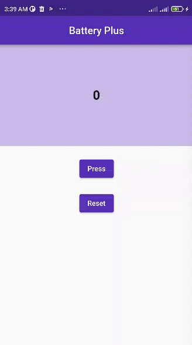
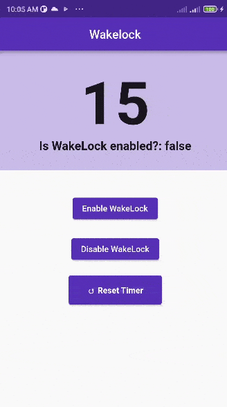
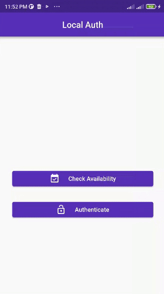
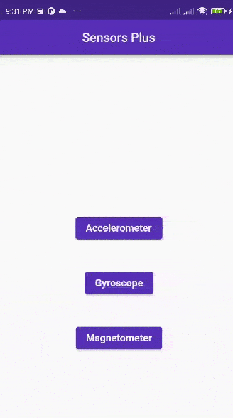
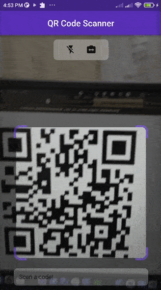

&nbsp;&nbsp;
&nbsp;&nbsp;
&nbsp;&nbsp;
&nbsp;&nbsp;

# Sensor Packages

</img>
Introduction to sensor packages: This repo will teach you some of the popular sensor controlling packages that are available in [pub.dev](https://pub.dev), & how to use them for the application development. These packages are for reading the sensors' output, hence requires an actual mobile device to check their reliability. I am using a `Redmi Note 9 Pro` phone for testing these packages in `app-release` mode. 
Playlist URLs:  
[YouTube: local_auth](https://www.youtube.com/watch?v=qTuVurGvdbM&t=2s) 
[YouTube: shake](https://www.youtube.com/watch?v=XVdexXpJIa0) 
[YouTube: qr_code_scanner](https://www.youtube.com/watch?v=hHehIGfX_yU) 

## Packages List:

1. [Battery Plus](/lib/1_battery_plus/battery_plus.dart) > final Battery \_battery = Battery() > batteryLevel = await \_battery.batteryLevel
2. [WakeLock](/lib/2_wakelock/wakelock.dart) > Wakelock.enable(); > Wakelock.disable();
3. [Local Auth](/lib/3_local_auth/local_auth.dart) > watch this [video](https://www.youtube.com/watch?v=qTuVurGvdbM&t=2s)
4. [Sensors Plus](/lib/4_sensors_plus/sensors_plus.dart) > userAccelerometerEvents.listen((UserAccelerometerEvent event){} > gyroscopeEvents.listen((GyroscopeEvent event){} > magnetometerEvents.listen((MagnetometerEvent event){}
5. [Shake](/lib/5_shake/shake.dart) > ShakeDetector.autoStart(onPhoneShake: () {})
6. [QR Code Scanner](/lib/6_qr_code_scanner/qr_code_scanner.dart) > watch this [video](https://www.youtube.com/watch?v=hHehIGfX_yU)

## Table of Contents:

<table align="center" style="margin: 0px auto;">
  <tr>
    <th>No.</th>
    <th>Name of the Package</th>
    <th>Package URL</th>
    <th>Screenshots</th>
  </tr>
  <tr>
    <td>1</td>
    <td><a href="lib/1_battery_plus/battery_plus.dart">Battery Plus</a></td>
    <td>&emsp;&emsp;&emsp;&emsp;&emsp;&emsp;&emsp;&emsp;&emsp;&emsp;&emsp;&emsp;
        
    <a href="https://pub.dev/packages/battery_plus" target="_blank">battery_plus: ^2.1.4</a>        </td>
    <td></img></td>
  </tr>
  <tr>
    <td>2</td>
    <td><a href="lib/2_wakelock/wakelock.dart">WakeLock</a></td>
    <td><a href="https://pub.dev/packages/wakelock" target="_blank">wakelock: ^0.6.1+2</a></td>
    <td></img></td>
  </tr>
  <tr>
    <td>3</td>
    <td><a href="lib/3_local_auth/local_auth.dart">Local Auth</a></td>
    <td><a href="https://pub.dev/packages/local_auth" target="_blank">local_auth: ^2.1.0</a></td>
    <td></img></td>
  </tr>
  <tr>
    <td>4</td>
    <td><a href="lib/4_sensors_plus/sensors_plus.dart">Sensors Plus</a></td>
    <td>&emsp;&emsp;&emsp;&emsp;&emsp;&emsp;&emsp;&emsp;&emsp;&emsp;&emsp;&emsp;
        
    <a href="https://pub.dev/packages/sensors_plus" target="_blank">sensors_plus: ^1.3.2</a>        </td>
    <td></img></td>
  </tr>
  <tr>
    <td>5</td>
    <td><a href="lib/5_shake/shake.dart">Shake</a></td>
    <td><a href="https://pub.dev/packages/shake" target="_blank">shake: ^2.1.0</a></td>
    <td></img></td>
  </tr>
  <tr>
    <td>6</td>
    <td><a href="lib/6_qr_code_scanner/qr_code_scanner.dart">QR Code Scanner</a></td>
    <td><a href="https://pub.dev/packages/qr_code_scanner" target="_blank">qr_code_scanner: ^1.0.0</a></td>
    <td></img></td>
  </tr>
</table>
